# Omura: Technical Architecture & Design

## Executive Summary

**Omura** is a multimodal search engine for the Walrus protocol that provides GPU-accelerated vector similarity search across blob content stored on the Sui blockchain. The system continuously discovers, indexes, and enables natural language search across images, text, audio, and video content using state-of-the-art embedding models and efficient vector search infrastructure.

### Walrus Protocol Overview

**Walrus** is a decentralized storage protocol built on the Sui blockchain that enables permanent, on-chain blob storage. Key characteristics:

- **Blob Storage**: Stores arbitrary binary data (images, videos, audio, documents, etc.) on-chain
- **Epoch-Based Lifecycle**: Blobs have a start epoch and end epoch defining their active period
- **Expiry System**: Blobs automatically expire when the current Sui epoch exceeds their `end_epoch`
- **Base64 Encoding**: Blob IDs are base64-encoded identifiers used for retrieval
- **Aggregator Network**: Distributed aggregator nodes provide HTTP access to blob content
- **Epoch Tracking**: Sui epochs increment periodically, enabling time-based blob expiration

**Walrus Blob Lifecycle:**
1. **Registration**: Blob uploaded to Walrus with `start_epoch` and `end_epoch`
2. **Active Period**: Blob is accessible while `current_epoch < end_epoch`
3. **Expiration**: Blob becomes inaccessible when `current_epoch >= end_epoch`
4. **Deletion**: Expired blobs can be deleted from storage (reclaiming space)

**Omura's Role**: Indexes active Walrus blobs for searchable discovery across the entire protocol, enabling users to find content without knowing blob IDs.

---

## System Architecture Overview

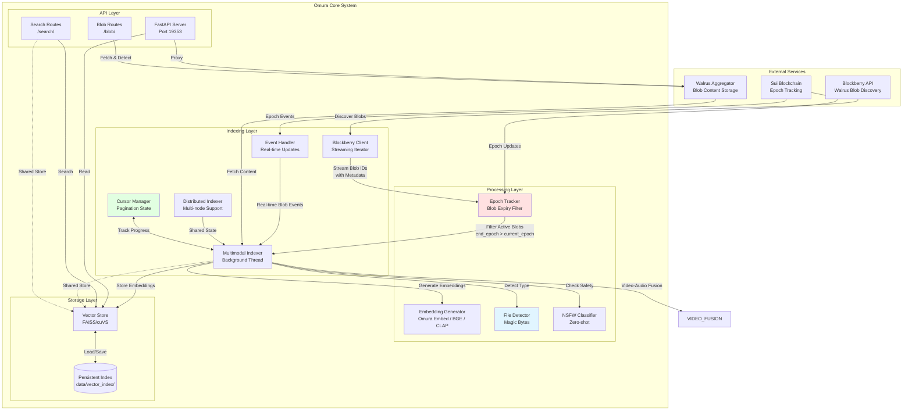

---

## Indexing Pipeline Architecture

### Discovery & Filtering Flow

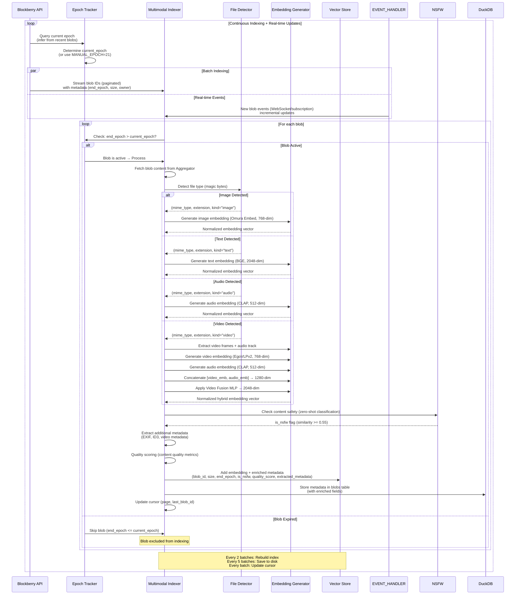

---

## File Type Recognition System

### Magic Bytes Detection Pipeline

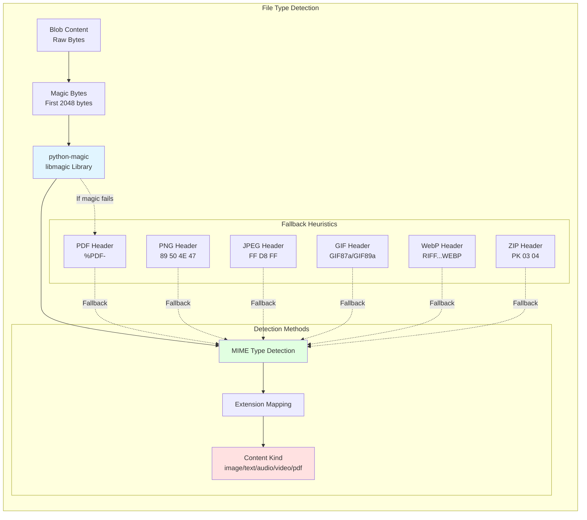

### File Type Detection Algorithm

```python
# Simplified detection flow
def detect_file_type(data: bytes) -> Tuple[str, str, str]:
    """
    Returns: (mime_type, extension, kind)
    
    Process:
    1. Use python-magic (libmagic) for comprehensive detection (first 2048 bytes)
    2. Map MIME type to extension via lookup table
    3. Determine content kind category (image/text/audio/video/pdf/archive/binary)
    4. Fallback to heuristics if magic fails
    """
```

**Supported File Types:**
- **Images**: PNG, JPEG, GIF, WebP, BMP, TIFF, SVG
- **Text**: Plain text, HTML, CSS, JavaScript, JSON, XML, Python
- **Audio**: MP3, WAV, OGG, FLAC
- **Video**: MP4, WebM, MOV, AVI, MKV
- **Documents**: PDF, DOC, DOCX, XLS, PPT
- **Archives**: ZIP, TAR, GZ, BZ2, 7Z, RAR
- **Binary**: Fallback to `application/octet-stream`

**Advanced File Parsing:**
- **PDF Text Extraction**: Deep content extraction using PyPDF (text content from PDFs)
- **Video Frame Sampling**: Intelligent keyframe extraction for video processing
- **Audio Transcription**: Speech-to-text capabilities for audio content (future: Whisper integration)
- **Metadata Extraction**: EXIF data from images, ID3 tags from audio, container metadata from videos
- **Content Chunking**: Split large documents into chunks for better embedding quality

---

## Epoch Tracking & Blob Expiry System

### Epoch-Based Expiry Architecture

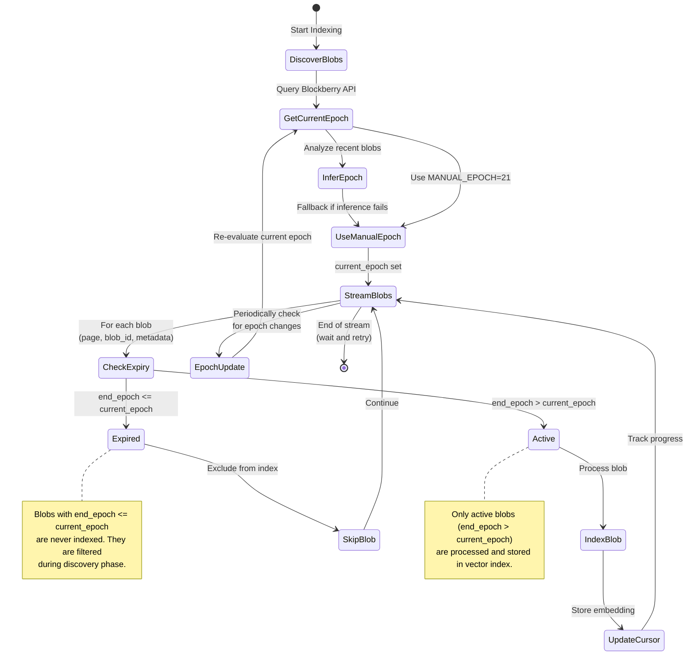

### Epoch Detection & Filtering

**Implementation:**
- **Manual Epoch Override**: `MANUAL_EPOCH = 21` (configurable fallback)
- **Automatic Inference**: Queries recent blobs from Blockberry API to infer current epoch
- **Real-time Epoch Tracking**: Monitor Sui blockchain for epoch changes via WebSocket subscriptions
- **Instant Updates**: Automatic re-evaluation of blob expiry on epoch changes
- **Filtering Logic**: `is_active = end_epoch > current_epoch`

**Epoch Metadata:**
- `startEpoch` / `start_epoch`: Epoch when blob was registered (immutable)
- `endEpoch` / `end_epoch` / `expiresAtEpoch`: Epoch when blob expires (defines active period)
- `current_epoch`: Inferred from recent blob metadata (most common start_epoch) or updated via WebSocket

**Real-time Epoch Tracking:**
```python
# WebSocket subscription to Sui blockchain
subscribe_to_epoch_changes():
    on_epoch_change(new_epoch):
        current_epoch = new_epoch
        # Trigger re-evaluation of blob expiry status
        re_evaluate_expired_blobs()
        # Update cursor with new epoch in DuckDB
        update_cursor(current_epoch=new_epoch)
```

**Expiry Handling:**
```python
# During blob discovery
for blob in stream_blobs():
    end_epoch = blob.get("endEpoch") or blob.get("end_epoch")
    is_active = int(end_epoch) > current_epoch
    
    if is_active:
        # Process and index blob
        index_blob(blob)
    else:
        # Skip expired blob
        continue
```

---

## Data Updates & Cursor Management

### Incremental Indexing with Cursor Tracking

```mermaid
graph TB
    subgraph "Cursor-Based Indexing"
        START[Start/Resume Indexing]
        LOAD[Load Cursor from DuckDB<br/>cursor table]
        CHECK{Cursor Exists?}
        
        NEW[Start from page 0]
        RESUME[Resume from<br/>last_page, last_blob_id]
        
        STREAM[Stream Blobs<br/>from last_page]
        BATCH[Batch Processing<br/>default: 100 blobs]
        PROCESS[Process Blob]
        
        UPDATE_CURSOR[Update Cursor<br/>page, last_blob_id]
        SAVE_CURSOR[Save Cursor<br/>to DuckDB cursor table]
        
        REBUILD[Rebuild Index<br/>Every 2 batches]
        PERSIST[Save to Disk<br/>Every 5 batches]
    end
    
    START --> LOAD
    LOAD --> CHECK
    CHECK -->|No cursor| NEW
    CHECK -->|Cursor exists| RESUME
    
    NEW --> STREAM
    RESUME --> STREAM
    
    STREAM --> BATCH
    BATCH --> PROCESS
    PROCESS --> UPDATE_CURSOR
    UPDATE_CURSOR --> SAVE_CURSOR
    
    SAVE_CURSOR --> REBUILD
    REBUILD --> PERSIST
    PERSIST --> STREAM
    
    style LOAD fill:#e1ffe1
    style RESUME fill:#ffe1e1
    style SAVE_CURSOR fill:#e1ffe1
```

### Cursor Structure

**Stored in DuckDB `cursor` table:**
```sql
-- Singleton table (only one row)
SELECT last_page, last_processed_blob_id, current_epoch, last_updated
FROM cursor
WHERE id = 1;
```

**Structure:**
- `id`: Always 1 (singleton constraint)
- `last_page`: Last processed page number (for paginated indexing)
- `last_processed_blob_id`: Last successfully indexed blob ID (for resumption)
- `current_epoch`: Current Walrus epoch (cached, updated via WebSocket)
- `last_updated`: Timestamp of last update

### Distributed Indexing Support

**Multi-Node Architecture:**
- **Shared DuckDB State**: All indexer nodes share the same DuckDB database for cursor state
- **Coordinated Indexing**: File locking ensures only one node processes each page
- **Distributed Vector Stores**: Each node maintains its own FAISS/cuVS index (can be merged)
- **Load Balancing**: Multiple indexer nodes can run in parallel with shared cursor tracking

**Incremental Updates:**
- **Event-Driven Indexing**: Real-time indexing of new blobs as they appear via WebSocket subscriptions
- **Batch + Real-time**: Combines batch pagination with real-time event processing
- **Incremental Sync**: Nodes sync cursor state and processed blob IDs periodically

**Cursor Functions:**
- **Resume Capability**: Indexer can resume from exact position after crash/restart
- **Skip Tracking**: When resuming, skips blobs until `last_processed_blob_id` is found
- **Progress Tracking**: Enables monitoring of indexing progress
- **Atomic Updates**: Cursor updated after each batch completion

### Update Strategy

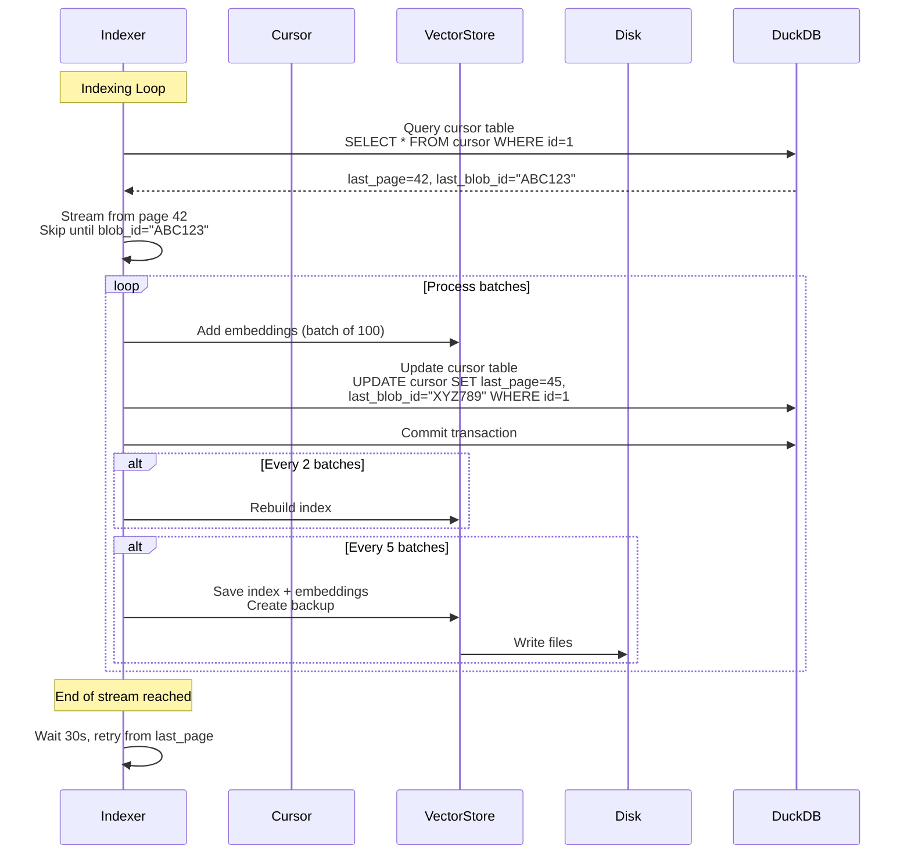

**Update Frequency:**
- **Cursor**: Updated after every batch (real-time progress tracking)
- **Index Rebuild**: Every 2 batches (~200 blobs)
- **Persistent Save**: Every 5 batches (~500 blobs)
- **Backups**: Created on every save (timestamped directories)

---

## Blob Expiry & Cleanup Strategy

### Current Expiry Handling

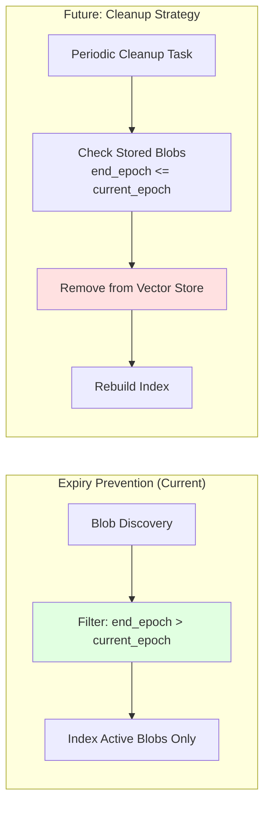

### Expiry Metadata Storage

**Stored in DuckDB `blobs` table:**
```sql
SELECT blob_id, size, owner, expiresAt, is_nsfw, indexed_at
FROM blobs
WHERE expiresAt <= current_epoch;
```

**Expiry Handling Strategy:**
- ✅ **Prevention**: Expired blobs are filtered during discovery (never indexed)
- ✅ **Automatic Cleanup**: Cron-based cleanup job removes expired blobs from index
- ✅ **Periodic Updates**: Epoch updates trigger re-evaluation of blob expiry status
- ✅ **SQL Queries**: Efficient expiry filtering using DuckDB indexed queries

### Epoch Update Handling

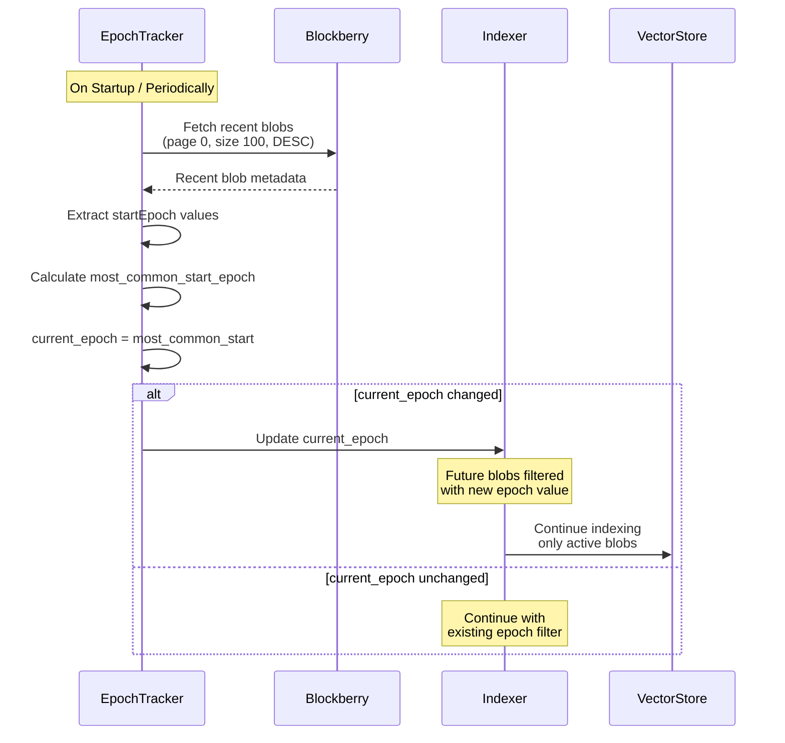

---

## Cron-Based Index Cleanup & Maintenance

### Cleanup Job Architecture

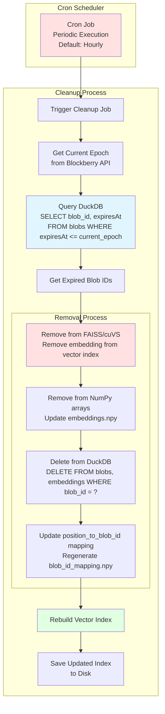

### Cleanup Job Flow

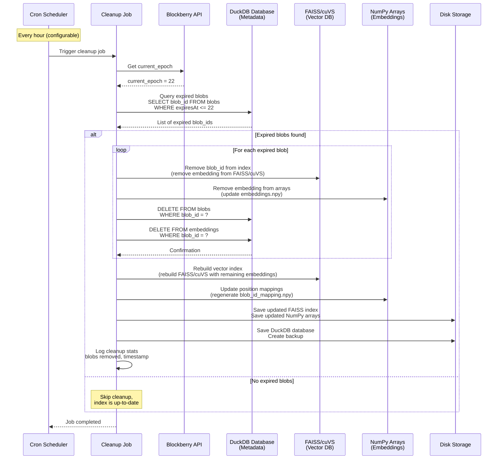

### Cleanup Job Configuration

**Schedule:**
- **Default**: Hourly (every 1 hour)
- **Configurable**: Via `OMURA_CLEANUP_INTERVAL_HOURS` environment variable
- **Alternative**: Cron expression for custom schedules

**Cleanup Process:**
1. **Epoch Detection**: Query Blockberry API for current epoch
2. **Database Query**: Query DuckDB for expired blobs (`expiresAt <= current_epoch`)
3. **Batch Removal**: Remove expired blobs from vector store (in-memory)
4. **Database Update**: Delete expired blob records from DuckDB
5. **Index Rebuild**: Rebuild FAISS/cuVS index with remaining embeddings
6. **Persistence**: Save updated index to disk with backup

**Performance:**
- **Batch Processing**: Process expired blobs in batches (configurable batch size)
- **Incremental Rebuild**: Only rebuild index after removals (optimize if no changes)
- **Locking**: Acquire lock during cleanup to prevent concurrent modifications

### Index Update Strategy

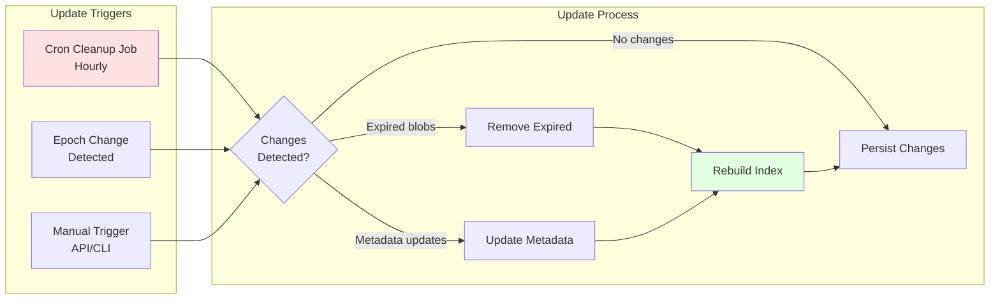

### Cron Job Implementation

**Job Types:**
1. **Cleanup Job**: Remove expired blobs (primary)
2. **Epoch Sync Job**: Update current epoch periodically (runs more frequently)
3. **Index Optimization Job**: Periodic index optimization/compaction (runs daily)

**Error Handling:**
- **Retry Logic**: Automatic retry on failures (exponential backoff)
- **Logging**: Comprehensive logging of cleanup operations
- **Metrics**: Track cleanup statistics (blobs removed, duration, errors)
- **Alerting**: Notify on cleanup failures or anomalies

---

## Storage Architecture: DuckDB Integration

### Database Schema Design

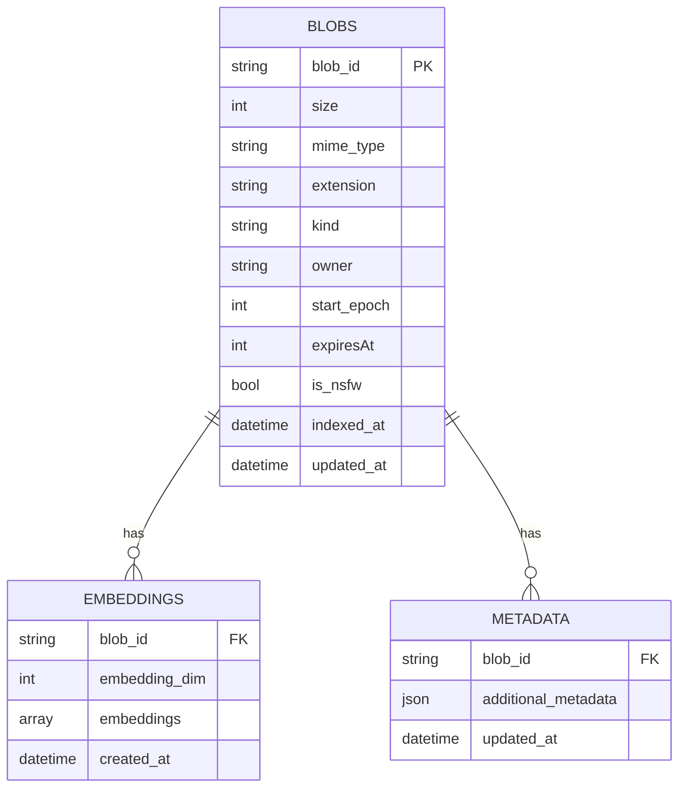

### DuckDB-Based Storage Architecture

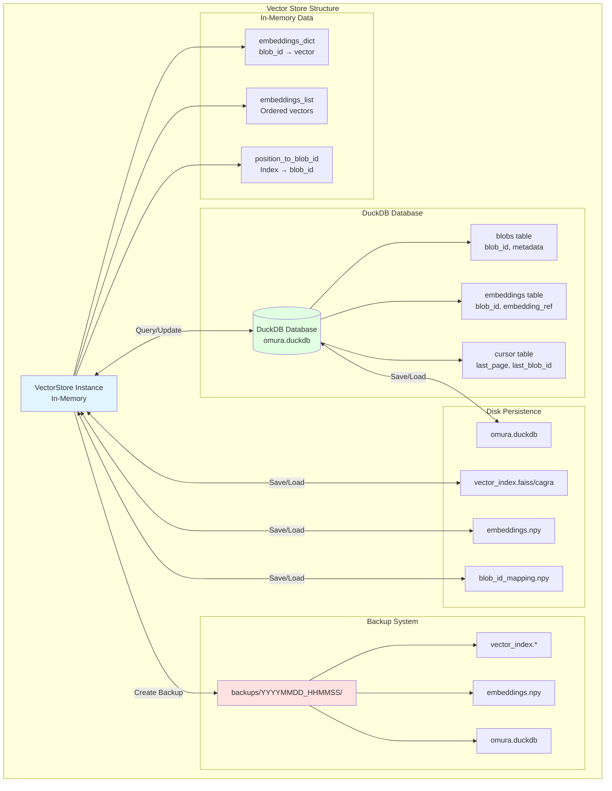

### DuckDB Schema

The DuckDB database schema defines three main tables for storing blob metadata, embedding references, and indexing state:

```sql
-- Main blobs table
-- Stores blob metadata including expiration, ownership, and content type
CREATE TABLE blobs (
    blob_id VARCHAR PRIMARY KEY,
    size INTEGER NOT NULL,
    mime_type VARCHAR,
    extension VARCHAR,
    kind VARCHAR,  -- image, text, audio, video, etc.
    owner VARCHAR,
    start_epoch INTEGER,
    expiresAt INTEGER,  -- end_epoch
    is_nsfw BOOLEAN DEFAULT FALSE,
    indexed_at TIMESTAMP DEFAULT CURRENT_TIMESTAMP,
    updated_at TIMESTAMP DEFAULT CURRENT_TIMESTAMP
);

-- Embeddings reference table
-- Maps blob_ids to embedding positions and dimensions
CREATE TABLE embeddings (
    blob_id VARCHAR PRIMARY KEY REFERENCES blobs(blob_id) ON DELETE CASCADE,
    embedding_dim INTEGER NOT NULL,  -- 768, 2048, etc.
    position INTEGER,  -- Position in embeddings_list
    created_at TIMESTAMP DEFAULT CURRENT_TIMESTAMP
);

-- Cursor/Indexing state table
-- Singleton table storing pagination state for incremental indexing
CREATE TABLE cursor (
    id INTEGER PRIMARY KEY DEFAULT 1,  -- Singleton row (always 1)
    last_page INTEGER DEFAULT 0,
    last_processed_blob_id VARCHAR,
    current_epoch INTEGER,
    last_updated TIMESTAMP DEFAULT CURRENT_TIMESTAMP,
    CHECK (id = 1)  -- Ensure only one row exists
);

-- Performance indexes
-- Optimize queries for expiry checks, modality filtering, and embedding lookups
CREATE INDEX idx_blobs_expiresAt ON blobs(expiresAt);
CREATE INDEX idx_blobs_kind ON blobs(kind);
CREATE INDEX idx_blobs_indexed_at ON blobs(indexed_at);
CREATE INDEX idx_embeddings_position ON embeddings(position);
CREATE INDEX idx_embeddings_blob_id ON embeddings(blob_id);
```

**Table Relationships:**
- `blobs` table: Primary metadata storage (one row per blob)
- `embeddings` table: Foreign key to `blobs.blob_id` (one-to-one relationship)
- `cursor` table: Singleton pattern (only one row with `id = 1`)
- Foreign key cascade: Deleting a blob automatically removes its embedding reference

### Storage Strategy

**Hybrid Storage Approach:**

The system uses a **hybrid architecture** where each component serves its optimal purpose:

- **FAISS/cuVS (Vector Database)**: 
  - Primary vector search engine for similarity search
  - Stores and indexes embedding vectors (768/2048-dim)
  - Handles fast k-NN search operations
  - Disk-persisted index files (`.faiss` or `.cagra`)
  - **Purpose**: Vector similarity search (images, text, audio, video)

- **DuckDB (Metadata & State Database)**:
  - Stores blob metadata (size, mime_type, owner, epochs, etc.)
  - Manages embedding references and position mappings
  - Tracks cursor state and indexing progress
  - Handles SQL queries for filtering, expiry checks, analytics
  - **Purpose**: Metadata storage, SQL queries, ACID transactions

- **NumPy Arrays (Embedding Storage)**:
  - Memory-mapped `.npy` files for embedding vectors
  - Used for loading embeddings into FAISS/cuVS
  - Efficient binary storage format
  - **Purpose**: Raw embedding vector storage

**Clear Separation of Concerns:**
- **Vector Search** → FAISS/cuVS (fast similarity search)
- **Metadata Queries** → DuckDB (SQL queries, filtering, analytics)
- **Raw Embeddings** → NumPy arrays (efficient storage)

**Benefits of Hybrid Approach:**
- ✅ **FAISS/cuVS**: Optimized for vector similarity search (specialized vector DB)
- ✅ **DuckDB**: Optimized for SQL queries and metadata operations (specialized SQL DB)
- ✅ **Best of Both**: Each database does what it's best at
- ✅ **No Conflicts**: FAISS handles vectors, DuckDB handles metadata

**Benefits of DuckDB for Metadata:**
- ✅ **SQL Queries**: Efficient querying of blob metadata, expiry filtering
- ✅ **ACID Transactions**: Reliable data consistency
- ✅ **Embedded Database**: No separate server required
- ✅ **High Performance**: Optimized columnar storage for analytics
- ✅ **Parquet Export**: Easy data export/backup
- ✅ **JSON Support**: Store complex metadata in JSON columns

**Data Flow:**
1. **Indexing**: 
   - Generate embeddings → Store in NumPy arrays
   - Build FAISS/cuVS index from NumPy arrays
   - Store blob metadata → DuckDB
   - Store embedding references → DuckDB

2. **Querying**: 
   - Search query → Generate query embedding
   - Vector search in FAISS/cuVS → Get top-k blob_ids with similarities
   - Query DuckDB with blob_ids → Get full metadata for results

3. **Cleanup**: 
   - Query DuckDB for expired blobs (SQL: `WHERE expiresAt <= current_epoch`)
   - Remove expired blob_ids from FAISS/cuVS index
   - Remove from NumPy arrays
   - Delete records from DuckDB
   - Rebuild FAISS/cuVS index

### Save/Load Cycle

**Save Triggers:**
- Every 5 batches during indexing
- Periodic save task (every 10 minutes)
- After cron cleanup job completion
- On graceful shutdown
- On error recovery (after max retries)

**Load Triggers:**
- On API server startup
- After indexer crash/restart
- After cron cleanup job (reload updated state)
- Manual reload via API/CLI

**Backup Strategy:**
- **Timestamped Directories**: `backups/20240115_103000/`
- **Complete State Snapshot**: DuckDB database + FAISS/cuVS index + NumPy embeddings
- **Automated Backup Rotation**: Automatic cleanup of old backups (configurable retention policy)
- **Backup Before Cleanup**: Create backup before cron cleanup jobs (safety net)
- **Incremental Backups**: Incremental backup support for large datasets
- **Backup Archival**: Automated archival strategies (local, cloud, long-term storage)
- **Backup Validation**: Automatic backup integrity checks

---

## Multimodal Embedding Architecture

### Complete Modality Support

Omura supports four primary modalities with specialized encoders and unified projection to a 2048-dim shared space:

#### 1. Image Modality

**Encoder**: Omura Embed ViT-B-16
- **Input**: Image bytes (PNG, JPEG, GIF, WebP)
- **Embedding Dimension**: 768-dim
- **Projection**: Image MLP (768 → 2048-dim)
- **Features**: Vision-language alignment, text-to-image search

#### 2. Text Modality

**Encoder**: BGE (BAAI General Embedding) Variant
- **Input**: Text strings (natural language queries, documents)
- **Embedding Dimension**: 2048-dim (native)
- **Projection**: Text MLP (2048 → 2048-dim, identity/normalization)
- **Features**: High-quality text embeddings, multilingual support

#### 3. Audio Modality

**Encoder**: CLAP (Contrastive Language-Audio Pre-training)
- **Input**: Audio bytes (MP3, WAV, OGG, FLAC)
- **Embedding Dimension**: 512-dim (native)
- **Projection**: Audio MLP (512 → 2048-dim, up-projection)
- **Features**: Audio-text alignment, audio search capabilities

#### 4. Video Modality (Hybrid Fusion)

**Video Encoder**: EgoVLPv2 (Egocentric Video-Language Pre-training v2)
- **Architecture**: TimeSformer-B backbone with cross-modal fusion in backbone
- **Input**: Video frames extracted from video file (MP4, WebM, MOV, AVI)
- **Embedding Dimension**: 768-dim (native)

**Audio Encoder**: CLAP (same as audio modality)
- **Input**: Audio track extracted from video file
- **Embedding Dimension**: 512-dim (native)

**Fusion Strategy**: Concatenation + MLP
```python
# Video-Audio Hybrid Pipeline
video_frames → EgoVLPv2 → video_emb (768-dim)
audio_track → CLAP → audio_emb (512-dim)

# Concatenation
combined = concat([video_emb, audio_emb])  # 768 + 512 = 1280-dim

# Fusion MLP Projection
Video Fusion MLP: 1280 → 1024 → 2048-dim

# Result: Unified 2048-dim embedding in shared space
```

**Video Fusion MLP Architecture:**
```
Input: 1280-dim (EgoVLPv2 768 + CLAP 512)
  ↓
Layer 1: 1280 → 1024 (bottleneck)
  ↓ [LayerNorm, GELU, Dropout(0.1)]
Layer 2: 1024 → 2048 (shared space)
  ↓ [LayerNorm]
Output: 2048-dim (normalized)
```

**Edge Cases:**
- **Silent Videos**: Zero-pad audio embedding (512-dim zeros)
- **Video-Only Processing**: Use EgoVLPv2 only (768-dim) if audio extraction fails
- **Audio Extraction Failure**: Fallback to video-only embedding

### Unified Shared Space

All modalities are projected to a unified **2048-dim shared space** enabling:
- **Cross-modal Search**: Text → Images, Audio, Video (and vice versa)
- **Multimodal Queries**: Combined queries across modalities
- **Unified Vector Store**: Single FAISS/cuVS index for all modalities
- **Semantic Alignment**: Similar content across modalities close in embedding space

### Training Strategy

**MLP Projection Training:**
- **Text-Based Training**: Use text encoders from each model to train MLPs
  - Omura Embed text (768) → BGE text (2048) → Train Image MLP
  - EgoVLPv2 text (RoBERTa-B, 768) → BGE text (2048) → Train Video MLP
  - CLAP text (512) → BGE text (2048) → Train Audio MLP
- **Transfer Learning**: Text-to-text projection transfers to visual/audio embeddings
- **Contrastive Loss**: Cosine similarity loss between projected and target embeddings
- **Video Fusion**: Train with video-audio-text triplets or concatenated text embeddings

### Modality Detection Flow

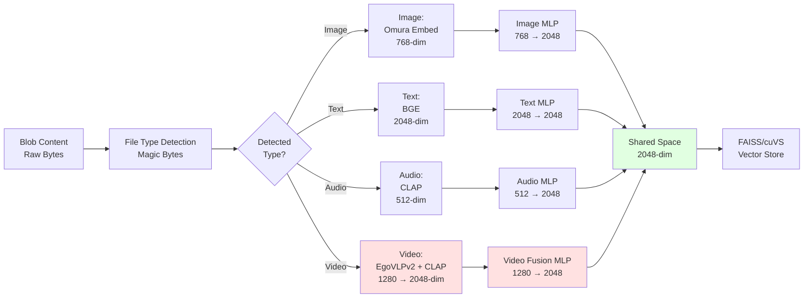

### Video Processing Pipeline

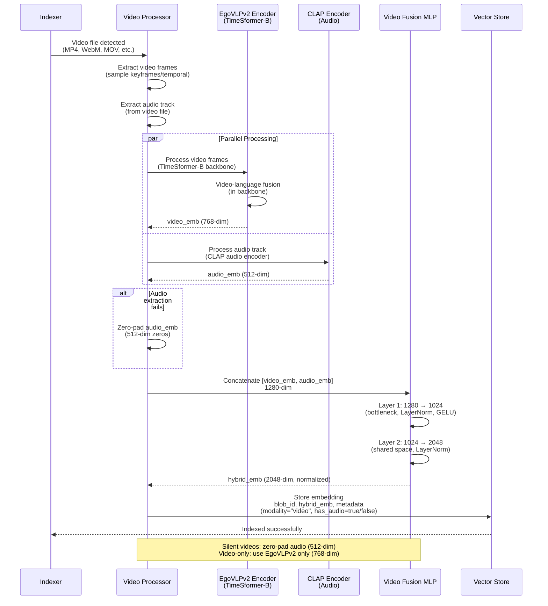

---

## Walrus Protocol Integration

### Walrus Protocol Architecture

**Walrus** is a decentralized blob storage protocol built on the Sui blockchain that enables permanent, on-chain blob storage. Key architectural components:

#### 1. On-Chain Storage
- **Blockchain Integration**: Blobs stored directly on Sui blockchain (immutable, permanent)
- **Epoch-Based Lifecycle**: Blobs have `startEpoch` and `endEpoch` defining active period
- **Base64 Identifiers**: Blob IDs are base64-encoded for retrieval (e.g., `DFBxFKxkkJ23oNMgn_baUcs5HVce_FEGrqJqlruEpRo`)
- **Owner Management**: Blobs have owners who can delete expired blobs

#### 2. Aggregator Network
- **Distributed Nodes**: Network of aggregator nodes provides HTTP access to blob content
- **Default Aggregator**: `https://walrus-mainnet-aggregator.redundex.com`
- **API Endpoint**: `/v1/blobs/{blob_id}` (HTTP GET)
- **Content Delivery**: Returns raw blob content with appropriate Content-Type headers
- **Load Balancing**: Multiple aggregators ensure high availability

#### 3. Epoch System
- **Sui Epochs**: Periodic epochs on Sui blockchain (time-based progression)
- **Epoch Metadata**: Each blob has `startEpoch` and `endEpoch` timestamps
- **Expiry Logic**: Blob expires when `current_epoch >= end_epoch`
- **Active Condition**: Blob is accessible while `current_epoch < end_epoch`

### Walrus Blob Structure

**Blob Metadata (from Blockberry API):**
```json
{
  "blobIdBase64": "DFBxFKxkkJ23oNMgn_baUcs5HVce_FEGrqJqlruEpRo",
  "size": 123456,
  "owner": "0x1234...",
  "startEpoch": 20,
  "endEpoch": 25,
  "deletable": true,
  "timestamp": "2024-01-15T10:30:00Z",
  "mimeType": "image/png"  // Optional, detected by Omura
}
```

**Key Fields:**
- `blobIdBase64`: Base64-encoded blob identifier (primary key)
- `size`: Blob size in bytes
- `owner`: Sui address of blob owner
- `startEpoch`: Epoch when blob was registered (immutable)
- `endEpoch`: Epoch when blob expires (defines active period)
- `deletable`: Whether blob can be deleted by owner
- `timestamp`: Registration timestamp

### Epoch Tracking & Blob Lifecycle

**Epoch Progression Example:**
```
Epoch 20: Blob registered (startEpoch = 20)
Epoch 21: Blob active (current_epoch = 21, endEpoch = 25) ✓
Epoch 22: Blob active (current_epoch = 22, endEpoch = 25) ✓
Epoch 23: Blob active (current_epoch = 23, endEpoch = 25) ✓
Epoch 24: Blob active (current_epoch = 24, endEpoch = 25) ✓
Epoch 25: Blob expires (current_epoch = 25, endEpoch = 25) ✗
Epoch 26: Blob inactive (current_epoch = 26, endEpoch = 25) ✗
```

**Omura's Epoch Handling:**
1. **Discovery Phase**: Filter blobs where `end_epoch > current_epoch` (active only)
2. **Indexing Phase**: Only index active blobs (prevent wasted compute)
3. **Cleanup Phase**: Periodically remove expired blobs from index via cron job
4. **Update Phase**: Re-evaluate epoch on each indexing cycle

### Walrus Discovery via Blockberry API

**Blockberry API** provides discovery and metadata services for Walrus blobs:

**Endpoints:**
- **Base URL**: `https://api.blockberry.one/walrus-mainnet/v1/blobs`
- **Authentication**: API key via `x-api-key` header
- **Pagination**: Page-based (default: 100 blobs per page)
- **Sorting**: By size (DESC), timestamp (DESC), or epoch
- **Filtering**: Active blobs only (epoch-based)

**API Response Format:**
```json
{
  "content": [
    {
      "blobIdBase64": "...",
      "size": 123456,
      "owner": "0x1234...",
      "startEpoch": 20,
      "endEpoch": 25,
      "timestamp": "2024-01-15T10:30:00Z"
    }
  ],
  "total": 1000,
  "page": 0,
  "size": 100
}
```

**Omura Discovery Flow:**
1. Query Blockberry API for blob metadata (paginated, sorted by size DESC)
2. Filter active blobs (`end_epoch > current_epoch`)
3. Extract blob IDs and metadata (size, owner, epochs, timestamp)
4. Stream blob IDs to indexer for processing
5. Update cursor for resumption capability

### Walrus Aggregator Integration

**Aggregator Network** provides HTTP access to blob content:

**Default Configuration:**
- **Aggregator URL**: `https://walrus-mainnet-aggregator.redundex.com`
- **Endpoint**: `/v1/blobs/{blob_id}`
- **Method**: HTTP GET
- **Response**: Raw blob content (binary)
- **Timeout**: 60 seconds (configurable)

**Omura Integration:**
- Fetches blob content from aggregator for indexing
- Handles MIME type detection via magic bytes
- Proxies blob content through `/blob/{blob_id}` endpoint
- Supports all Walrus blob types (images, videos, audio, documents, archives)

**Content Access:**
- **Direct Access**: `GET /v1/blobs/{blob_id}` (from aggregator)
- **Proxied Access**: `GET /blob/{blob_id}` (via Omura with MIME detection)
- **Frontend Use**: `` (automatic MIME type handling)

### Blob Expiry & Deletion

**Expiry Behavior:**
- **Automatic Expiry**: Blobs become inaccessible when `current_epoch >= end_epoch`
- **Deletion**: Expired blobs can be deleted by owner (reclaiming storage space)
- **Index Cleanup**: Omura removes expired blobs from index via cron job

**Cleanup Strategy:**
1. **Prevention**: Filter expired blobs during discovery (never index active expired content)
2. **Cron-Based Cleanup**: Periodic cron job removes blobs that expire after indexing (hourly scheduled)
3. **Real-time Epoch Updates**: Re-evaluate blob expiry on epoch changes via WebSocket subscriptions
4. **Database Queries**: Efficient SQL queries in DuckDB with query optimization for expiry checks (`WHERE expiresAt <= current_epoch`)
5. **Distributed Cleanup**: Multi-node cleanup coordination via shared DuckDB state (only leader node executes)
6. **Incremental Cleanup**: Process cleanup in batches to avoid blocking search operations
7. **Automatic Rebuild**: Rebuild FAISS/cuVS index after cleanup completes
8. **Backup Before Cleanup**: Create backup before cleanup operations (safety net)

**Expiry Query Example:**
```sql
-- Query expired blobs for cleanup
SELECT blob_id, expiresAt, indexed_at
FROM blobs
WHERE expiresAt <= (
    SELECT current_epoch FROM cursor WHERE id = 1
)
ORDER BY indexed_at DESC;
```

---

## Indexing Workflow Summary

### Complete Flow

```mermaid
flowchart TD
    START([API Startup])
    
    INIT[Initialize Vector Store<br/>Load from disk if exists]
    LOAD_CURSOR[Load Cursor<br/>from DuckDB]
    
    START_INDEXER[Start Background Indexer<br/>Daemon Thread]
    
    GET_EPOCH[Get Current Epoch<br/>Infer or use MANUAL_EPOCH]
    
    STREAM[Stream Active Blobs<br/>from Blockberry API<br/>page-by-page]
    
    CHECK_CURSOR{Cursor<br/>Resume?}
    SKIP[Skip until<br/>last_blob_id]
    START_FRESH[Start from<br/>beginning]
    
    BATCH[Collect Blobs<br/>Batch size: 100]
    
    PARALLEL[Parallel Processing<br/>4 workers]
    
    FETCH[Fetch Blob Content<br/>from Aggregator]
    DETECT[Detect File Type<br/>Magic Bytes]
    
    FILTER_MODALITY{Modality?}
    IMAGE[Generate Image Embedding<br/>Omura Embed, 768-dim]
    TEXT[Generate Text Embedding<br/>BGE, 2048-dim]
    AUDIO[Generate Audio Embedding<br/>CLAP, 512-dim]
    VIDEO[Generate Video Embedding<br/>EgoVLPv2 (768) + CLAP (512)<br/>→ Fusion MLP → 2048-dim]
    
    ADD[Add to Vector Store<br/>with metadata]
    
    UPDATE_CURSOR[Update Cursor<br/>page, last_blob_id]
    
    CHECK_BATCH{Batch<br/>Count?}
    REBUILD2[Rebuild Index<br/>Every 2 batches]
    SAVE5[Save to Disk<br/>Every 5 batches]
    CONTINUE[Continue]
    
    END_STREAM{End of<br/>Stream?}
    WAIT[Wait 30s<br/>Retry]
    
    ERROR{Error?}
    RETRY[Retry Logic<br/>Max 5 retries]
    SAVE_ERROR[Save Progress<br/>Create Backup]
    
    START --> INIT
    INIT --> LOAD_CURSOR
    LOAD_CURSOR --> START_INDEXER
    START_INDEXER --> GET_EPOCH
    GET_EPOCH --> STREAM
    
    STREAM --> CHECK_CURSOR
    CHECK_CURSOR -->|Resume| SKIP
    CHECK_CURSOR -->|New| START_FRESH
    SKIP --> BATCH
    START_FRESH --> BATCH
    
    BATCH --> PARALLEL
    PARALLEL --> FETCH
    FETCH --> DETECT
    DETECT --> FILTER_MODALITY
    
    FILTER_MODALITY -->|Image| IMAGE
    FILTER_MODALITY -->|Text| TEXT
    FILTER_MODALITY -->|Audio| AUDIO
    FILTER_MODALITY -->|Video| VIDEO
    
    IMAGE --> ADD
    TEXT --> ADD
    AUDIO --> ADD
    VIDEO --> ADD
    
    ADD --> UPDATE_CURSOR
    UPDATE_CURSOR --> CHECK_BATCH
    
    CHECK_BATCH -->|2 batches| REBUILD2
    CHECK_BATCH -->|5 batches| SAVE5
    CHECK_BATCH -->|Other| CONTINUE
    
    REBUILD2 --> CONTINUE
    SAVE5 --> CONTINUE
    CONTINUE --> END_STREAM
    
    END_STREAM -->|More| STREAM
    END_STREAM -->|Complete| WAIT
    WAIT --> STREAM
    
    FETCH -.->|Error| ERROR
    DETECT -.->|Error| ERROR
    IMAGE -.->|Error| ERROR
    TEXT -.->|Error| ERROR
    AUDIO -.->|Error| ERROR
    VIDEO -.->|Error| ERROR
    ADD -.->|Error| ERROR
    
    ERROR -->|Retry| RETRY
    ERROR -->|Max Retries| SAVE_ERROR
    RETRY --> PARALLEL
    SAVE_ERROR --> WAIT
    
    style INIT fill:#e1f5ff
    style GET_EPOCH fill:#ffe1e1
    style DETECT fill:#e1ffe1
    style ADD fill:#fff4e1
```

---

## Key Design Decisions

### 1. **Epoch-Based Filtering**
- **Rationale**: Prevent indexing of expired blobs at discovery phase
- **Benefit**: No wasted compute on expired content
- **Implementation**: Real-time epoch tracking via WebSocket subscriptions to Sui blockchain
- **Epoch Updates**: Automatic re-evaluation on epoch changes with instant filtering

### 2. **Cursor-Based Resumption**
- **Rationale**: Enable crash recovery without re-indexing
- **Benefit**: Efficient incremental updates, progress tracking
- **Implementation**: Stores page number + last processed blob ID

### 3. **Magic Bytes Detection**
- **Rationale**: Accurate file type detection independent of filename/extensions
- **Benefit**: Works with raw blob content, handles misnamed files
- **Fallback**: Heuristic detection for common formats if libmagic unavailable

### 4. **Batch Processing with Periodic Saves**
- **Rationale**: Balance between performance and data safety
- **Benefit**: Efficient indexing with regular persistence
- **Frequency**: Cursor (every batch), Index rebuild (every 2 batches), Save (every 5 batches)

### 5. **Separate Modality Processing with Unified Projection**
- **Rationale**: Different encoders for different content types (optimal quality per modality)
- **Benefit**: Optimal embedding quality per modality + unified cross-modal search
- **Implementation**: Specialized encoders (Omura Embed, BGE, CLAP, EgoVLPv2) with projection MLPs to shared 2048-dim space
- **Cross-Modal Search**: All modalities searchable in unified space (text→image/audio/video, etc.)

---

## Performance Characteristics

### Indexing Performance
- **Throughput**: ~100 blobs per batch (configurable)
- **Parallelism**: 4 worker threads (configurable)
- **Filtering**: Epoch-based filtering happens during discovery (minimal overhead)
- **File Detection**: <1ms per blob (magic bytes scan)

### Storage Efficiency
- **Embeddings**: ~3KB per embedding (768/2048-dim float32)
- **Metadata**: ~200 bytes per blob (stored in DuckDB, compressed)
- **Index Overhead**: FAISS/cuVS index structures (~10-20% of embedding size)

### Reliability
- **Crash Recovery**: Automatic via cursor-based resumption
- **Data Safety**: Periodic saves + automatic backups
- **Error Handling**: Retry logic with exponential backoff

---

### Cleanup Job API Integration

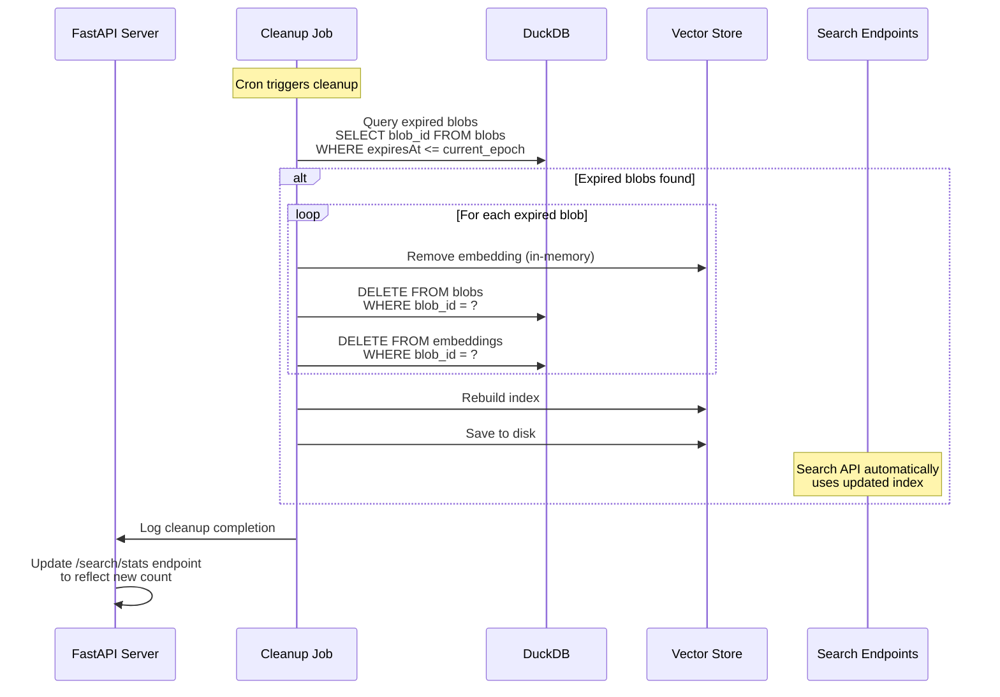

---

## Conclusion

Omura's architecture provides a robust, scalable foundation for multimodal blob search on the Walrus protocol. The combination of epoch-based filtering, cursor-based resumption, and efficient file type detection ensures reliable and performant indexing of active blob content while maintaining data integrity through persistent storage and backup mechanisms.

